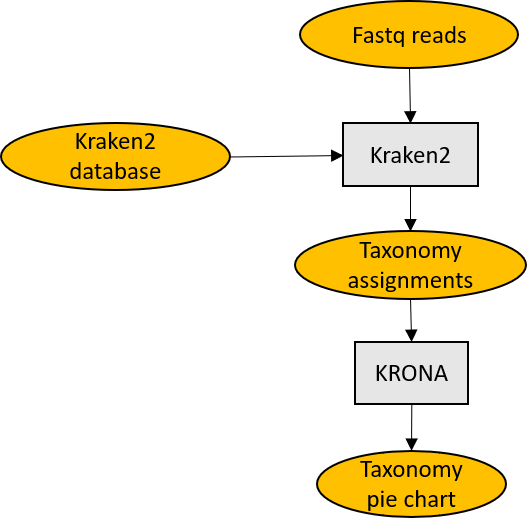
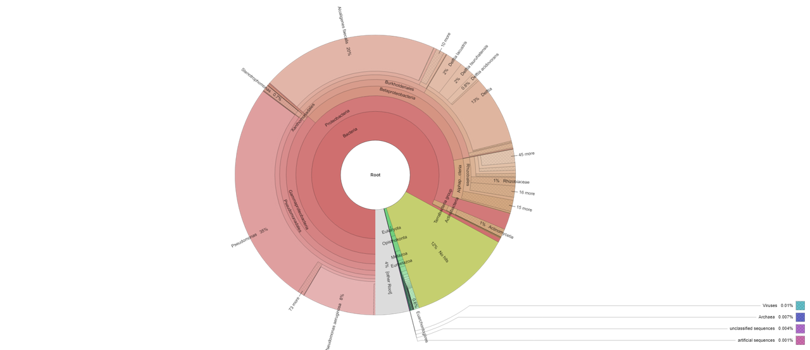

# MetaKraken2
A Metagenomic pipeline for Kraken2 analysis and Krona report generation.

**MetaKraken2** is a Metagenomic pipeline for Kraken2 analysis and Krona report generation. It classifies each read with Kraken2 and then generates an interactive pie chart with Krona.

<p align="center">
  
</p>

## Getting started

**Prerequisites**

* Miniconda3.
Tested with conda 4.9.2.
```which conda``` should return the path to the executable.
If you don't have Miniconda3 installed, you could download and install it with:
```
wget https://repo.anaconda.com/miniconda/Miniconda3-latest-Linux-x86_64.sh
chmod 755 Miniconda3-latest-Linux-x86_64.sh
./Miniconda3-latest-Linux-x86_64.sh
```


* A Kraken2-indexed database. You could download one precompiled database from [here](https://benlangmead.github.io/aws-indexes/k2) or generate one using **Build_Kraken2_db.sh** script.

* A fastq file containing sequences you want to analyse. 

**Installation**

```
git clone https://github.com/MaestSi/MetaKraken2.git
cd MetaKraken2
chmod 755 *
./install.sh
```

A conda environment named _MetaKraken2_env_ is created, where kraken2 and Krona are installed.

## Usage

**MetaKraken2.sh**

Usage:
./MetaKraken2.sh -f \<sample\_name.fastq\> -db \<kraken2_db\> -t \<threads\>

Inputs:

* \<sample\_name.fastq\>: fastq file containing reads to be analysed
* \<kraken2_db\>: kraken2-indexed database
* \<threads\>: maximum number of threads to use

Outputs:

* \<sample_name\>\_kraken2_output.txt: Kraken2 output
* \<sample_name\>\_kraken2_report.txt: Kraken2 report used by Krona for html report generation
* \<sample_name\>\_kraken2_report\_Krona_report.html: interatctive pie chart produced by Krona

**Build_Kraken2_db.sh**

Usage:
./Build_Kraken2_db.sh -db \<kraken2_db\> -t \<threads\>

Inputs:

* \<kraken2_db\>: kraken2 database you want to build. Possible choices are: archaea, bacteria, plasmid, viral, human, fungi, plant, protozoa, nr, nt, UniVec, UniVec_Core
* \<threads\>: maximum number of threads to use

Output:

* \<kraken2_db\>\_db: folder containing kraken2 database


## Results visualization

After completing the analysis, you can open \<sample_name\>\_kraken2_report\_Krona_report.html with a browser.

<p align="center">
  
</p>

## Citations

Please refer to the following manuscripts for further information.

Kraken2: Wood DE, Lu J, Langmead B. Improved metagenomic analysis with Kraken 2. Genome Biol. 2019 Nov 28;20(1):257. doi: 10.1186/s13059-019-1891-0. PMID: 31779668; PMCID: PMC6883579.

Krona: Ondov BD, Bergman NH, Phillippy AM. Interactive metagenomic visualization in a Web browser. BMC Bioinformatics. 2011 Sep 30;12:385. doi: 10.1186/1471-2105-12-385. PMID: 21961884; PMCID: PMC3190407.

